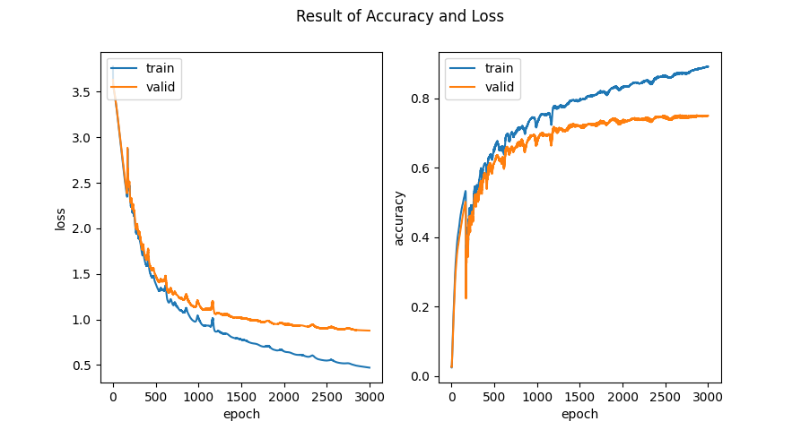
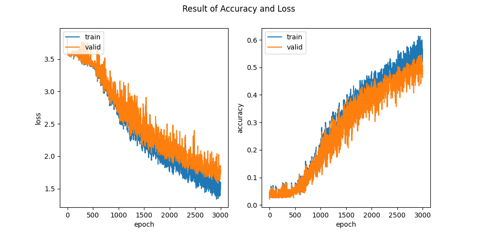
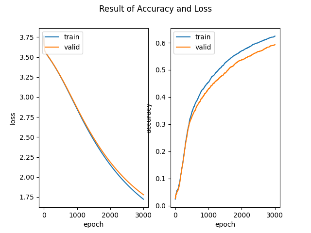
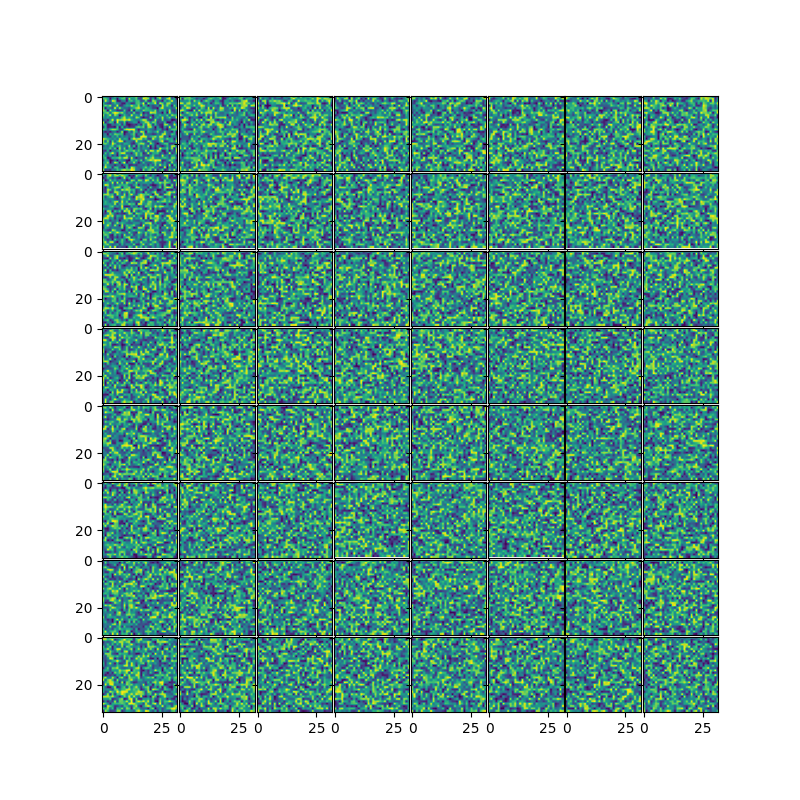
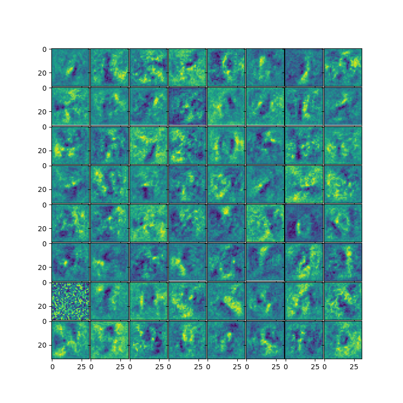

# 1 Implement a Fully Connected Network
## 1.1
## 1.1.1
If we set all weights to zero, every neuron will have same value at initial step. In back propagation, all the update of weights will be same. As a result, their is no meaningful results when we use multi layer perceptron. 

## 1.1.3
If there is a symmetric at initial weight of NN, each neuron with same weight behave same with same input. For example, if all the weights are initialized with 1, the result of back propagation will be same. So no matter of the inputs, if weights are same, the value of hidden layer will be equal. To remove such behavior, we have to use different weights without symmetric at initialization step. So we use random values. 

Cause we use variance of weights to be 1. In this case, variance of weights are inverse propotional to the size of input. So we approximate variacne of weights to be 2 / (in_size + out_size)

## 1.2
### 1.2.2
$$softmax = \frac{e^i}{\sum_{j=1}^{K}e^j} $$
If we shift $x_i$ to c, the qeuation is change to
$$softmax = \frac{e^{x_i + c}}{\sum_{j=1}^{K}e^{x_j + c}} $$
We can remove c in both denominator and numerator. Then the final output is same as first one. So softmax is invariant to translation. 

If we use c = -max(x_i), we can reduce the floating point error of big number. Cause exponent of e is increase exponently, If we use large x_i, we may reach maximun value of varaibe. To remove such error, it is reasonable to use c = max(x_i).

### 1.2.3
1. $s_i \in (0, \infty)$, $S\in (0, \infty)$ and, $softmax\in(0,1)$
2. normalized 0 and 1
3. s_i compute exponent of inputs, and S is sum of exponents. And finally we compute softmax by s_i/S.

# 2 Training Models
## 2.1
### 2.1.1
I success accuracy on the validation set of 75% by epoch 3000, batch_size 6000 and learning rate 0.000005. It is difficult to set appropriate epoch and learning rate due to it's slow learing speed. I can find that with large enough batch_size and epoch, the accuracy of validation set is getting closer to accuracy of traning set. 

### 2.1.2

As you can see, when loss of tranning set dicreases, the accuracy of tranning set is increase. There is inverse relation with these two factors. 

### 2.1.3
| Best Result | 10 times of learing rate | 0.1 times of learing rate |
|:---:|:---:|:---:|
||||
| Learning rate fluctuate little. | Learning rate flutuate large. Missing to gradient toward lowest point of loss. | Learning rate flutation is hard to find. Too slow to learn. |

In nutshell, it is important to set accurate learing rate to avoid slow learning and avoid randomness at learing. 

### 2.1.4
| Weight at initial step | Weight after learning |
|:---:|:---:|
|||

When compare to the intial weights to final learned weights, there exist some pattern of image at the final outcomes. These patterns are look like some alphabet and number. So we can find that our neural network actually learn some patterns at our test set and made a mask for classfications. 

# 3 Image Compression with Autoencoders
## 3.2
### 3.2.1

As you can see the loss curve is stably decreases without any peak of the curve. This is because momentem approach of gradient update reduces the locality of the solving problem. As the concept of the momentem imvolved, the model update it's gradient more stable way. In other words, the locality of the learing is reduced. 

### 3.2.2
|||||
|:--:|:--:|:--:|:--:|:--:|
|Figure 1|Figure 2|Figure 3|Figure 4|Figure 5|
||||||
|Figure 1|Figure 2|Figure 3|Figure 4|Figure 5|
||||||

### 3.2.3
> Average PSNR: 12.078883466091533

As you can see from my result, PSNR is sufficently small to prove that my autoencoder actually produce some image to perceived by human. 
### Extra (Just for fun)
|Loss graph of ReLU | Loss graph of sigmoid |
|:---:|:---:|
|||

If you compare loss graph of each update methods (ReLU and Sigmoid), you can found that ReLU is more stable then sigmoid update method. 